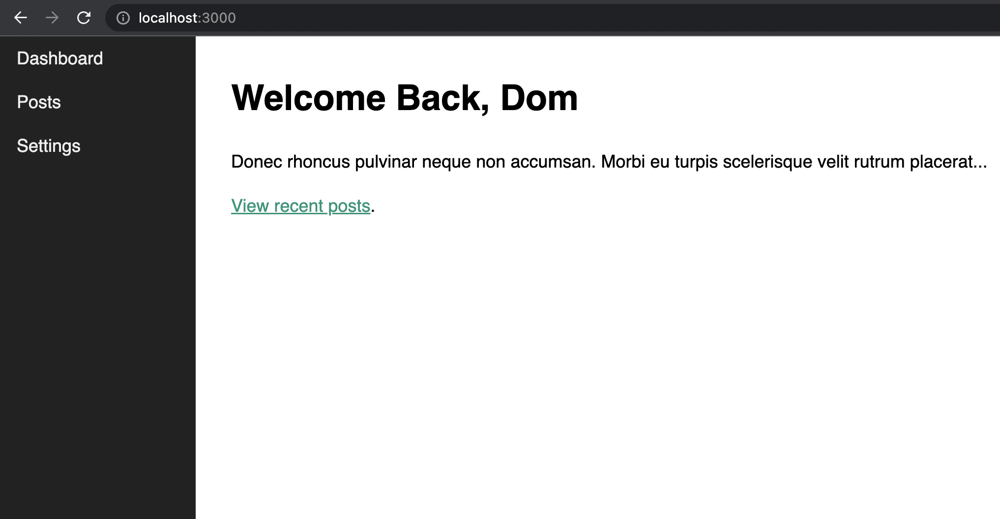
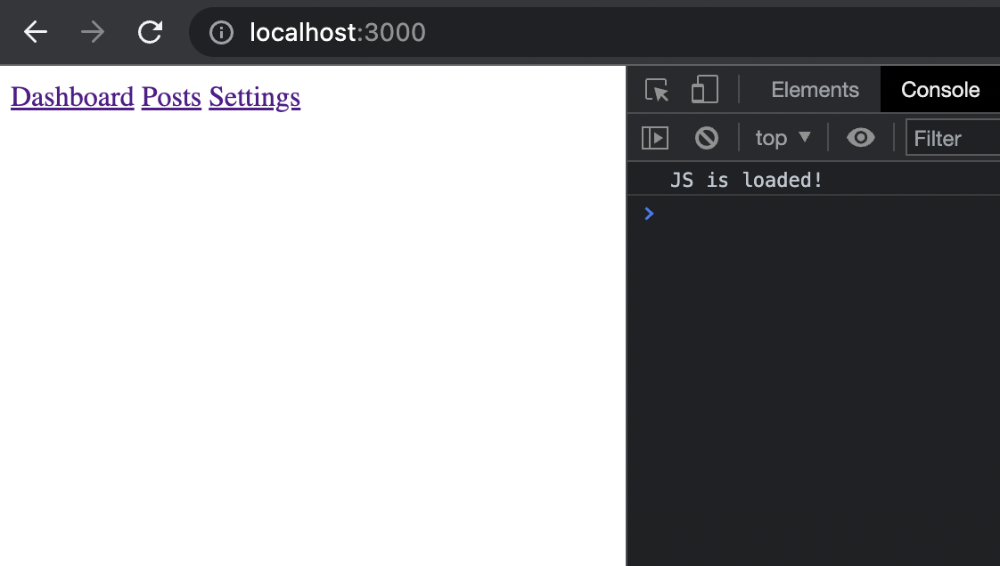

# JavaScript Single Page Application

Walkthrough of dcode's [Build a Single Page Application with JavaScript (No Frameworks)
](https://www.youtube.com/watch?v=6BozpmSjk-Y)



1. Create a `project/` folder
2. Create `/frontend/`
3. Create `/frontend/index.html`
4. In the body, add:
    ```html
    <script type="module" src="/static/js/index.js"></script>
    ```
    `type="module"` because we are taking advantage of ES6 import/export syntax (our views are each going to have their own JS class)
5. Above the `<script>` tag, add:
    ```html
    <nav class="nav">
        <a href="/" class="nav__link" data-link>Dashboard</a>
        <a href="/posts" class="nav__link" data-link>Posts</a>
        <a href="/settings" class="nav__link" data-link>Settings</a>
    </nav>
    ```
    `data-link`, using the History API, avoids page refresh
6. In the project directory, run:
    ```sh
    $ npm init
    ```
7. Install Express:
    ```sh
    $ npm i express
    ```
8. Create `/server.js`:
    ```js
    const express = require('express')
    const path = require('path')

    const app = express()

    // For any path, go to the root and send back index.html
    app.get('/*', (req, res) => {
        res.sendFile(path.resolve(__dirname, 'frontend', 'index.html'))
    })

    listener = app.listen(process.env.PORT || 3000, () => console.log(`Server running on port ${listener.address().port}`))
    ```
9. Create `root/static/js/index.js`. This will house the code that will allow a visitor to use links and navigate the site. For now, just put some placeholder output:
    ```js
    console.log('JS is loaded!')
    ```
10. Whenever the path has `/static` in it, we want to serve the `static` directory as usual. This will enable `index.js`, which we just created. Add to `server.js`:
    ```js
    app.use('/static', express.static(path.resolve(__dirname, 'frontend', 'static')))
    ```
    Now, if you go to `localhost:3000/` in the browser and check the console, you should see our placeholder output from `index.js`:
    
11. Now let's set up routing. Add the following in `index.js`:
    ```js
    const router = async () => {
        const routes = [
            { path: '/', view: () => console.log('Viewing Dashboard') },
            { path: '/posts', view: () => console.log('Viewing Posts') },
            { path: '/settings', view: () => console.log('Viewing Settings') },
        ]

        // Test each route for potential match
        const potentialMatches = routes.map(route => {
            return {
                route: route,
                isMatch: location.pathname === route.path
            }
        })

        let match = potentialMatches.find(potentialMatch => potentialMatch.isMatch)

        // No matches, let's just go to dashboard
        if (!match) {
            match = {
                route: routes[0],
                isMatch: true
            }
        }

        // Check that we know what view we should see
        console.log(match.route.view())
    }

    document.addEventListener('DOMContentLoaded', () => {
        router()
    })
    ```
12. Implement navigation for the `data-link` elements via the history API:
    ```js
    const navigateTo = url => {
        history.pushState(null, null, url)
        router()
    }

    document.addEventListener('DOMContentLoaded', () => {
        document.body.addEventListener('click', e => {
            if (e.target.matches('[data-link]')) {
                e.preventDefault()
                navigateTo(e.target.href) // Use our custom navigation behavior taking advantage of the history API
            }
        })
        
        router()
    })
    ```
13. Set up forward/backward navigation:
    ```js
    window.addEventListener('popstate', router)
    ```
14. Each view will have its own JS class file. Begin with the abstract class, `/frontend/static/js/views/AbstractView.js`:
    ```js
    export default class {
        constructor() {
            
        }

        setTitle(title) {
            document.title = title
        }

        async getHtml() {
            return ''
        }
    }
    ```
15. Create the Dashboard class alongside the abstract class in `Dashboard.js`:
    ```js
    import AbstractView from './AbstractView.js'

    export default class extends AbstractView {
        constructor() {
            super()
            this.setTitle('Dashboard')
        }

        async getHtml() {
            return `
                <h1>Welcome Back, Dom</h1>
                <p>
                    Donec rhoncus pulvinar neque non accumsan. Morbi eu turpis scelerisque velit rutrum placerat...
                </p>
                <p>
                    <a href='/posts' data-link>View recent posts</a>.
                </p>
            `
        }
    }
    ```
16. Back in `index.js`, import and use the Dashboard class in place of the `console.log` statement in our view resolution object:
    ```js
    import Dashboard from './views/Dashboard.js'
    ```
    ```js
    const router = async () => {
        const routes = [
            { path: '/', view: Dashboard },
        
        // ...

        const view = new match.route.view()
        
        document.querySelector("#app").innerHTML = await view.getHtml()
    }
    ```
17. Create `Posts.js` and `Settings.js`:
    ```js
    import AbstractView from './AbstractView.js'

    export default class extends AbstractView {
        constructor() {
            super()
            this.setTitle('Posts')
        }

        async getHtml() {
            return `
                <h1>Posts</h1>
                <p>You are viewing the posts.</p>
            `
        }
    }
    ```
    ```js
    import AbstractView from './AbstractView.js'

    export default class extends AbstractView {
        constructor() {
            super()
            this.setTitle('Settings')
        }

        async getHtml() {
            return `
                <h1>Settings</h1>
                <p>Manage your privacy and configuration.</p>
            `
        }
    }
    ```
    Update the `routes` obj in `index.js`:
    ```js
    { path: '/posts', view: Posts },
    { path: '/settings', view: Settings },
    ```
17. Let's add some styling. Create `/frontend/static/css/index.css`:
    ```css
    body {
        --nav-width: 200px;
        margin: 0 0 0 var(--nav-width);
        font-family: 'Quicksand', sans-serif;
        font-size: 18px;
    }

    .nav {
        position: fixed;
        top: 0;
        left: 0;
        width: var(--nav-width);
        height: 100vh;
        background: #222222;
    }

    .nav__link {
        display: block;
        padding: 12px 18px;
        text-decoration: none;
        color: #eeeeee;
        font-weight: 500;
    }

    .nav__link:hover {
        background: rgba(255, 255, 255, 0.05);
    }

    #app {
        margin: 2em;
        line-height: 1.5;
        font-weight: 500;
    }

    a {
        color: #009579;
    }
    ```
    In `index.html`, after the `<title>` element, add:
    ```html
    <link rel="stylesheet" href="/static/css/index.css">
    ```